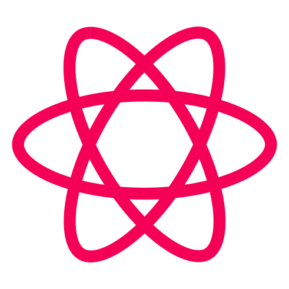

  

<h1 align="center">
protondb-check
</h1>

  
  
    
  
  

  

 

> <code>protondb-check</code> is currently in active development stage, there might be bugs or other problems.

## Table Of Contents

- [About](#about)
- [Available commands](#available-commands)
- [Install](#install)
- [To do](#to-do)
- [Known issues](#known-issues)

# About

`protondb-check` relies on data provided by Steam on products you own and later on lets you choose the game you want to check utilizing ProtonDB API.

# Available commands

> While `-p` or `-a` are both listed as not required, at least one should be provided.

| Command        | Description                                     | Args                | Required | Example                               |
| -------------- | ----------------------------------------------- | ------------------- | -------- | ------------------------------------- |
| protondb-check | Choose one game from all owned                  | `-p` `--profile-id` | No       | `protondb-check -p 76561198354374976` |
| protondb-check | Check particular app even if not owned in Steam | `-a` `--app-id`     | No       | `protondb-check -a 1145360`           |

# Install

## Windows / Linux

You can install `protondb-check` via

`cargo install protondb-check`

or using prebuilt binaries on the [Releases](https://github.com/gpskwlkr/protondb-check/releases) page.

## MacOS

Only `cargo install protondb-check` available for MacOS.

## Compiling from source

### Dependencies

- cargo
- rustc
- openssl
- pkg-config / pkgconf

`git clone https://github.com/gpskwlkr/protondb-check && cd protondb-check`

`cargo build --release`

`cd target/release && ./protondb-check`

# To do

- [ ] Tests coverage
- [x] Refactor code to be more safe
- [x] Refactor code to work with `clap` for better args
- [x] Receive single app-id through args
- [ ] Receive single game name through args
- [ ] Better way to handle filtering out DLCs
- [ ] More to come...

# Known issues

- [ ] DLC filtering is kinda bad, right now, if you have 0 hours on record in any steam product, it won't be included in `protondb-check` list, since Steam doesn't count hours on DLC's, soundtracks, etc.

If anything else occurs, feel free to submit to [issues](https://github.com/gpskwlkr/protondb-check/issues) page, otherwise, you can join [Discord](https://discord.gg/dR25EbTW) server.
